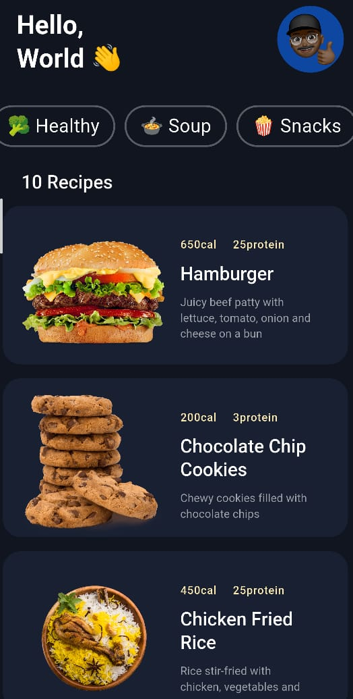
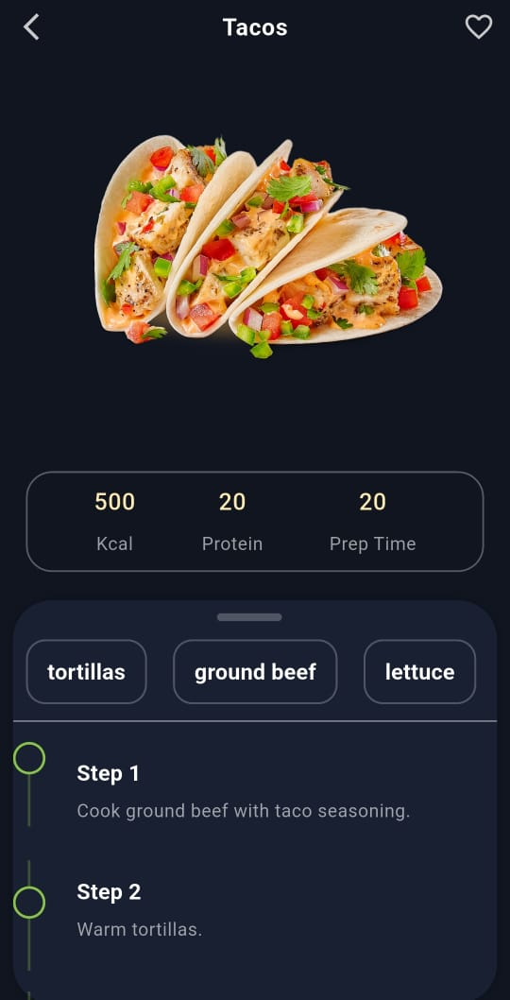
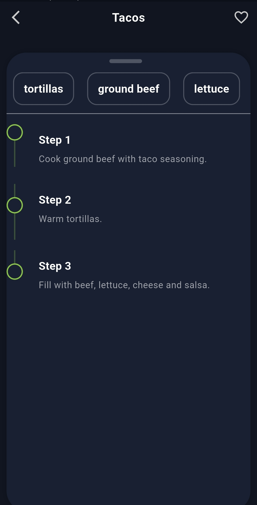

# 🍔 Flutter Food App (Animation UI)

A beautifully designed **Flutter Food Recipe App** featuring smooth animations, clean UI, and interactive cooking steps.
This project is inspired by modern Dribbble designs and focuses on delivering an engaging user experience with elegant transitions.

---

## ✨ Features

* 🎨 Clean and modern UI design
* ⚡ Smooth page transitions & animations
* 📱 Responsive layout
* 🍳 Recipe details with step-by-step guide
* ✅ Interactive timeline (mark steps as completed)
* 🌙 Dark theme support
* 🧠 Built with scalable architecture

---

## 🧱 Architecture

This project follows a **feature-based clean architecture**:

```
lib/src
│
├── core
│   ├── animation
│   ├── constants
│   ├── theme
│   └── widgets
│
├── onboarding
│
└── recipes
    ├── domain
    ├── data
    └── presentation
```

* **Domain** → Business logic & entities
* **Data** → Local JSON & repositories
* **Presentation** → UI & screens

---

## 🛠️ Tech Stack

* Flutter 🐦
* Dart 💙
* Riverpod (State Management)
* Freezed (Model generation)
* JSON Serialization
* Custom Animations (`flutter_animate`)

---

## 📸 Screenshots
## 📸 Screenshots

### 🏠 Home Screen


### 🏠 Home Variant


### 📅 Booking Screen






---

## 🚀 Getting Started

### 1. Clone the repository

```bash
git clone https://github.com/DheerajPandey88/flutter_food_app.git
cd flutter_food_app
```

### 2. Install dependencies

```bash
flutter pub get
```

### 3. Run the app

```bash
flutter run
```

---

## 📂 Assets

* Recipes stored locally in JSON
* Images inside `assets/images/`

---

## 🎯 Purpose

This project is built for:

* Practicing Flutter UI & animations
* Learning clean architecture
* Building portfolio projects
* UI/UX experimentation

---

## 🤝 Contributing

Contributions are welcome!

1. Fork the repo
2. Create a new branch
3. Commit your changes
4. Open a Pull Request

---

## 👨‍💻 Author

Developed with ❤️ using Flutter

